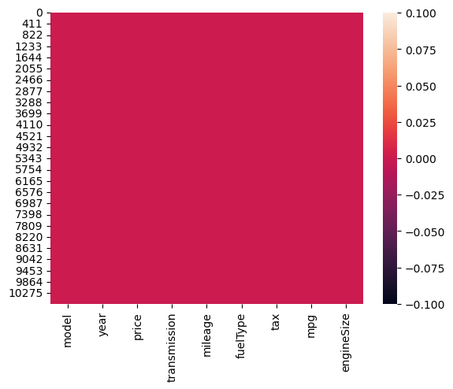
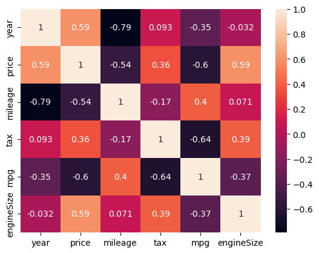
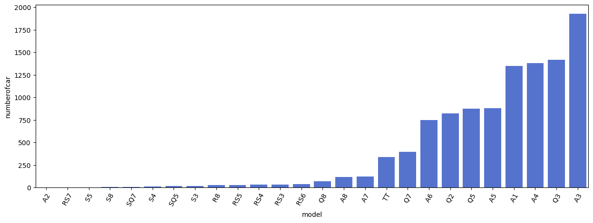

# Laporan Proyek Machine Learning
## Nama : Tri wahyono
## Nim : 211351145
## Kelas : Malam A
# Domain Proyek
Proyek ini akan fokus pada analisis data yang diperoleh dari dataset "US CARS" yang diambil dari Kaggle. Dataset ini berisi informasi tentang mobil bekas yang tersedia untuk dijual di US. Analisis ini bertujuan untuk mendapatkan wawasan tentang pasar mobil bekas di uS ( AUDI), termasuk tren, faktor yang memengaruhi harga
# Business Understanding
Pasar mobil bekas di US sangat besar dan beragam, dengan berbagai merek, tahun, dan kondisi kendaraan yang ditawarkan. Proyek ini bertujuan untuk memberikan wawasan tentang pasar ini.

# Problem Statements
Pasar mobil bekas di US adalah pasar yang besar, tetapi informasi tentang tren, preferensi merek, dan faktor-faktor yang memengaruhi harga sulit ditemukan
# Goals
Memberikan pemahaman yang mendalam tentang pasar mobil bekas di US dan menyediakan wawasan yang berguna bagi pembeli, penjual, dan pemangku kepentingan lainnya.

# Solution statements
- Melalui analisis data, penggunaan machine learning jika relevan, proyek ini akan memberikan pemahaman yang lebih baik tentang pasar mobil bekas di US.

- Berdasarkan analisis, kami akan menghasilkan laporan mendalam, visualisasi data yang informatif, dan jika memungkinkan, model prediksi harga yang dapat digunakan oleh pemangku kepentingan untuk mengambil keputusan yang lebih baik di pasar mobil bekas.

- Model yang di hasilkan menggunakan metode Regresi Linier

# Data Understanding
Dataset US CARS diperoleh dari Kaggle. Dataset ini berisi informasi tentang mobil bekas di US.Setelah dilakukan pembersihan data, dataset ini berisi sekitar 39.300 baris data dan lebih dari 10 kolom yang mencakup berbagai aspek tentang mobil bekas.

[AUDI used car in us](https://www.kaggle.com/datasets/adityadesai13/used-car-dataset-ford-and-mercedes?select=audi.csv)
## Variabel-variabel pada US CARS Dataset adalah sebagai berikut:
- model (string)
- price (float)
- Transmission (string)
- mileage (int)
- fueltype (string)
- tax (int)
- mpg (int)
- engineSize (int)

# Data Preparation
# Data Collection
Untuk data collection ini, saya mendapatkan dataset dari kaggle dengan nama dataset US CARS

# Data Discovery And Profiling
Untuk bagian ini, saya menggunakan teknik EDA.<br>
1. mengimport semua library yang dibutuhkan.
``` bash
import pandas as pd
import numpy as np
import matplotlib.pypot as plt
import seaborn as sns
```
2. Memanggil Dataset
``` bash
df = pd.read_csv('audi.csv')
```
3. Melihat 5 Baris Dataset
``` bash
df.head()
```
4. Melihat Data Dari Masing Masing Kolom Menggunakan Property Info 
``` bash
df.info()
```
5. Memeriksa Dataset 
```  bash
sns.heatmap(df.isnull())
```

6. Mendeskripsikan Data
``` bash
df.describe()
```
7. Visualisasi Data Atau Mengexploration Data
``` bash
numeric_df = df.select_dtypes(include=['number'])
sns.heatmap(numeric_df.corr(), annot=True)
```
<br>
8. Dibawah ini adalah jumlah mobil berdasarkan model
``` bash
models = df.groupby('model').count()[['tax']].sort_values(by='tax',ascending=True).reset_index()
models = models.rename(columns={'tax':'numberofcar'})
```
``` bash
fig = plt.figure(figsize=(15,5))
sns.barplot(x=models['model'], y=models['numberofcar'],color='royalblue')
plt.xticks(rotation=60)
```
<br>
9. Modeling Fitur
    Seleksi fitur
``` bash
features = ['year','mileage','tax','mpg','engineSize', 'Transmission', 'fueltype, 'model']
x = df[features]
y = df['price']
x .shape, y.shape
```
((10668, 5), (10668,))

10. Lalu Split Data Training Dan Testing
``` bash
from sklearn.model_selection import train_test_split
x_train,x_test, y_train, y_test = train_test_split(x,y,random_state=70)
y_test.shape
```
(2667,)

11. Membuat Regresi Linier
``` bash
from sklearn.linear_model import LinearRegression
lr = LinearRegression()
lr.fit(x_train,y_train)
pred = lr.predict(x_test)
```
12. Mengevaluasi Data
``` bash
score = lr.score(x_test, y_test)
print('akurasi model regresi linear = ', score)
```
akurasi model regresi linear =  0.7594637694494413

13. Membuat Inputan Regresi Linier
``` bash
input_data = np.array([[2019,5000,145,30.2,2]])
prediction = lr.predict(input_data)
print('estimasi mobil dalam EUR : ',prediction)
```
estimasi mobil dalam EUR :  [33720.47965492]

14. Deployment

[My App](https://mesinlearning-2-pwmxgqegbajty8kahdrkx3.streamlit.app/).
## Data set kaggle
[File data sett](https://www.kaggle.com/datasets/adityadesai13/used-car-dataset-ford-and-mercedes?select=audi.csv)
## tampilan 


